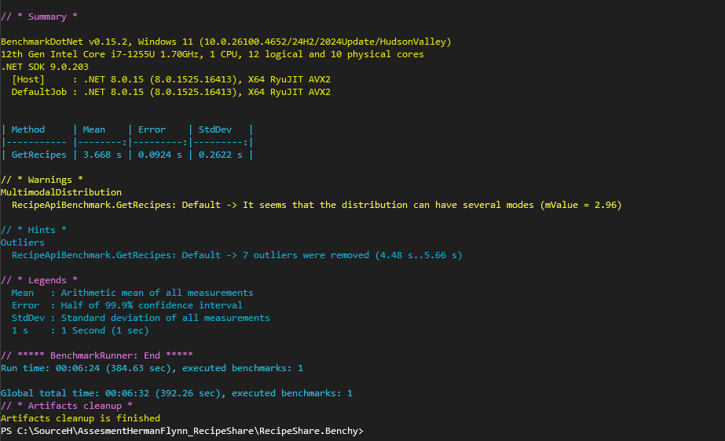

# RecipeShare Application

A full-stack web application designed for managing and discovering recipes. This project features a decoupled architecture with a React-based frontend and an ASP.NET Core API backend, leveraging Entity Framework Core for data persistence.

## Table of Contents
  - [Setup Instructions](#setup-instructions)
  - [Prerequisites](#prerequisites)
  - [Backend (ASP.NET Core API) Setup](#backend-aspnet-core-api-setup)
  - [Frontend (React App) Setup](#frontend-react-app-setup)
  - [Architecture Diagram](#architecture-diagram)
  - [Rationale](#rationale)
  - [Overall Architecture](#overall-architecture)
  - [Backend Structure (ASP.NET Core)](#backend-structure-aspnet-core)
  - [Data Access (Entity Framework Core)](#data-access-entity-framework-core)
  - [Dietary Tags Handling](#dietary-tags-handling)
  - [Project Separation](#project-separation)

## Setup Instructions

Follow these steps to get the RecipeShare application running on your local machine.

### Prerequisites

Before you begin, ensure you have the following installed:

* **.NET SDK (8.0 or newer recommended):** Download from [dotnet.microsoft.com](https://dotnet.microsoft.com/download).
* **Node.js (LTS version recommended):** Download from [nodejs.org](https://nodejs.org/en/download/). Includes npm.
* **SQL Server (LocalDB, Express, or full SQL Server):** Used for database persistence. Ensure you have SQL Server Management Studio (SSMS) or Azure Data Studio for management.
* **Git:** For cloning the repository.
* **Visual Studio (or Visual Studio Code with C# Dev Kit):** For backend development.
* **VS Code (recommended for frontend):** For React development.

### Backend (ASP.NET Core API) Setup

1.  **Clone the Repository:**
    Navigate to your desired directory and clone the entire solution:
    ```bash
    git clone https://github.com/HermanFlynn/RecipeShare.git
    cd RecipeShare
    ```

2.  **Open the Solution:**
    Open the `RecipeShare.sln` file in Visual Studio.

3.  **Database Configuration:**
    * Open `appsettings.json` within the `RecipeShare` project.
    * Locate the `ConnectionStrings` section and update the `WebApiDatabase` string to point to your local SQL Server instance.
        Example (for LocalDB):
        ```json
        "ConnectionStrings": {
            "WebApiDatabase": "Server=(localdb)\\mssqllocaldb;Database=RecipeShareDb;Trusted_Connection=True;MultipleActiveResultSets=true"
        }
        ```
    * **Apply Migrations:** Use Entity Framework Core Migrations to create the database schema:
        Open the **Package Manager Console** in Visual Studio (Tools > NuGet Package Manager > Package Manager Console).
        Make sure `RecipeShare.Util` is selected as the "Default project" in the Package Manager Console dropdown.
        ```powershell
        dotnet ef migrations add InitialCreate
        dotnet ef database update
        ```

4.  **Configure CORS (if necessary):**
    Ensure that the CORS policy in `RecipeShare` (API) project's `Program.cs` is configured to allow requests from React frontend's origin.

5.  **Run the API:**
    * In Visual Studio, set `RecipeShare.API, and frontend` as the startup project. If the Visual Studio installed is setup for react projects, otherwize only 'RecipeShare.API'.
    * Press `F5` or click the "Run" button to start the API.
    * Note the URL where the API is listening `http://localhost:5154`. You'll need this for the frontend.

### Frontend (React App) Setup, needed if VS is not configured to run the front end.

1.  **Navigate to the Frontend Directory:**
    Open a new terminal or command prompt and navigate to the `frontend` directory:
    ```bash
    cd "RecipeShare\frontend"
    ```

2.  **Install Dependencies:**
    ```bash
    npm install
    ```

3.  **Configure API Base URL:**
    Open `App.jsx` (or `App.js`) in the `frontend/src` directory.
    Update the `API_BASE_URL` constant to match the URL where the ASP.NET Core API is running.
    ```javascript
    const API_BASE_URL = 'http://localhost:5154/recipe';
    ```

4.  **Run the React App:**
    ```bash
    npm start
    ```
    This will usually open the application in your default browser at `http://localhost:3000` but may be deferent. 

---
## Architecture Diagram

This high-level diagram illustrates the main components of the RecipeShare application and their interaction flow.
(Note: This diagram is rendered using Mermaid.js and might require a compatible Markdown viewer like GitHub's for proper display.)

```mermaid
graph TD
    subgraph Client Application
        A[React Frontend]
    end

    subgraph Backend System (ASP.NET Core)
        B[API Controllers] --> C{Service Layer}
        C --> D{Data Access Layer}
        D --> E((SQL Server Database))

        subgraph Shared Libraries
            F[RecipeShare.Util]
            G[RecipeShare.Utils]
        end
    end

    subgraph Development & Testing
        Test[RecipeShare.Test]
    end

    A -- HTTP Requests --> B
    B -- Orchestrates --> C
    C -- Persists/Retrieves --> D
    D -- Communicates With --> E

    B -- Utilizes --> F
    B -- Utilizes --> G
    C -- Utilizes --> F
    C -- Utilizes --> G
    D -- Utilizes --> F
    D -- Utilizes --> G

    Test -- Tests Components In --> B
    Test -- Tests Components In --> C
    Test -- Tests Components In --> D
    Test -- Tests Components In --> F
    Test -- Tests Components In --> G
```
## Rationale


### Overall Architecture

The RecipeShare application adopts a **decoupled, two-tier architecture**, consisting of a React frontend and an ASP.NET Core backend. This separation provides several significant benefits:

* **Scalability:** Frontend and backend components can be scaled independently based on their respective load demands, optimizing resource usage.
* **Independent Development:** Different development teams or individuals can work on the frontend and backend concurrently with minimal interdependencies, accelerating the development process.
* **Technology Flexibility:** This approach allows for the selection of the most suitable technology stack for each layer (JavaScript/React for an interactive UI, C#/ASP.NET Core for robust and performant backend services).
* **Maintainability:** Clear separation of concerns simplifies debugging, refactoring, and the implementation of new features, as changes in one layer are less likely to impact others.
* **API Reusability:** The established backend API can easily be consumed by other client applications in the future, such as native mobile apps, without requiring significant backend modifications.

### Backend Structure (ASP.NET Core)

The backend follows a **layered architecture** pattern, which is crucial for promoting separation of concerns, enhancing maintainability, and improving testability across the application:

* **API (Presentation Layer - `RecipeShare`):**
    * This project primarily contains the **Controllers**, which are responsible for handling incoming HTTP requests, routing them to the appropriate business logic, and formatting the responses. It acts as the primary gateway for communication with the frontend.
* **Service Layer (Implicit within `RecipeShare` or a dedicated library like `RecipeShare.Core`):**
    * This layer encapsulates the core business logic and rules of the application. Services coordinate operations, perform data validation, and interact with the data access layer. This ensures that business rules are applied consistently regardless of the API endpoint being hit.
* **Data Access Layer (Implicit within `RecipeShare` or a dedicated library like `RecipeShare.Infrastructure`):**
    * This layer is dedicated to handling all interactions with the database. It abstracts away the complexities of data storage, ensuring that the service layer (and higher layers) do not need to be aware of the specific database technology or query language.
* **Shared/Utility Libraries (`RecipeShare.Util`, `RecipeShare.Utils`):**
    * These projects contain common components such as shared models (e.g., `Recipe` entity, `DietaryTagEnums`), Data Transfer Objects (DTOs), helper functions, interfaces, and other reusable code. Their purpose is to promote code reusability across different backend layers and reduce duplication.

### Data Access (Entity Framework Core)

**Entity Framework Core (EF Core)** is utilized as the Object-Relational Mapper (ORM) for managing database interactions:

* **Code-First Approach:** The database schema is defined directly through C# classes (entities). EF Core Migrations are used to manage schema evolution and version control, simplifying database updates as the application develops.
* **Abstraction:** EF Core abstracts away the need for writing raw SQL queries. Developers can interact with the database using familiar LINQ queries against C# objects, which significantly improves developer productivity and inherently helps mitigate common SQL injection vulnerabilities.

### Dietary Tags Handling

The management of dietary tags demonstrates a robust approach to enum handling across the full stack:

* **Backend Implementation:** Dietary tags are strongly typed as C# `enum` types on the backend. This provides compile-time safety and ensures that only predefined, valid tags can be associated with a recipe.
* **Frontend Input Flexibility:** The React frontend offers flexibility, allowing users to input dietary tags either by their readable string name (e.g., "Vegan", "GlutenFree") or by their corresponding numerical value (e.g., "2" for Vegan, "4" for GlutenFree).
* **Client-Side Conversion:** The frontend includes logic to convert all user input (whether string or number) into canonical string names before sending the data to the API. This provides a user-friendly experience while maintaining a consistent data format for the API.
* **Backend Serialization/Deserialization:** The ASP.NET Core API is specifically configured with `JsonStringEnumConverter`. This crucial configuration ensures that `DietaryTagEnums` are seamlessly serialized to and deserialized from their string names in JSON payloads. This makes the API's responses more human-readable and simplifies data exchange with the frontend.

### Project Separation

The overall solution is deliberately organized into multiple distinct projects (e.g., `RecipeShare` for the API, `RecipeShare.Test` for testing, `RecipeShare.Util`, `RecipeShare.Utils` for shared components, and `frontend` for the UI). This modular structure offers several key advantages:

* **Modularity:** Each project has a clear, singular responsibility, which makes the codebase easier to understand, navigate, and manage for developers.
* **Reusability:** Common logic, models, and interfaces residing in shared utility projects (`RecipeShare.Util`, `RecipeShare.Utils`) can be easily referenced and reused across different parts of the backend, or even in future applications.
* **Testability:** Dedicated test projects (`RecipeShare.Test`) enable the creation of isolated unit, integration, and potentially functional tests for different layers of the application, leading to a more robust and reliable system.
* **Faster Builds:** Changes made within one project generally only necessitate the recompilation of that specific project and its immediate dependents, which significantly speeds up build times during development cycles.

## Benchmark Results

Here are the benchmark results for 500 sequential calls to `GET /api/recipes`:

